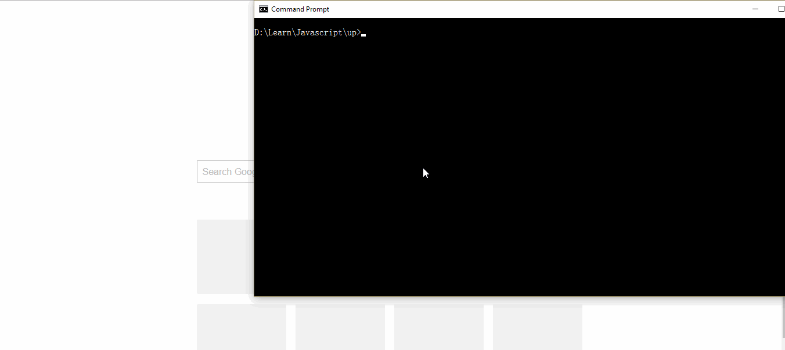

# ข้อมูลที่ปลอมขึ้นโดยใช้ภาษา Javascript
> แนวทางการใช้งาน สามารถจำลองเป็น REST API โดยใช้ json-server จำลองขึ้นมา

<p align="center">
</a>
</p>

#### 1. ติดตั้ง json-server ผ่าน npm

```
  npm install -g json-server
```

#### 2. Start Server

```
  json-server --watch db.js
```

> เราก็จะได้ API ของข้อมูลมาเล่นกันแล้ว สามารถเข้าไปที่ทดสอบได้ที่ http://localhost:3000/users

```
  GET    /users
  GET    /users/:id
  POST   /users
  PUT    /users/:id
  PATCH  /users/:id
  DELETE /users/:id
```
